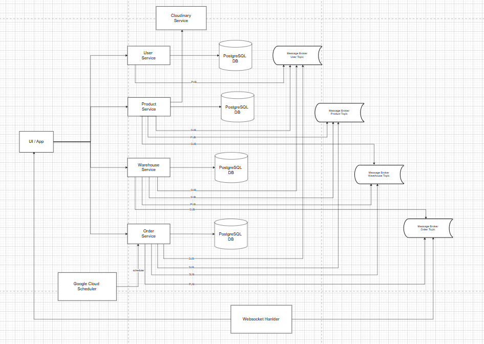
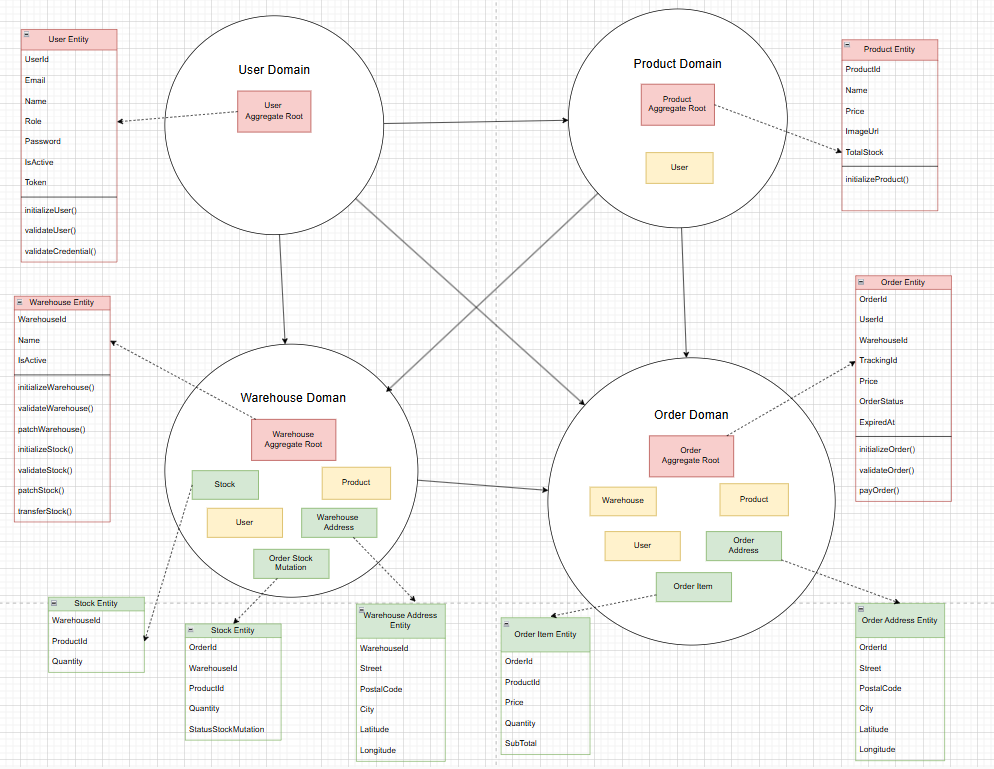
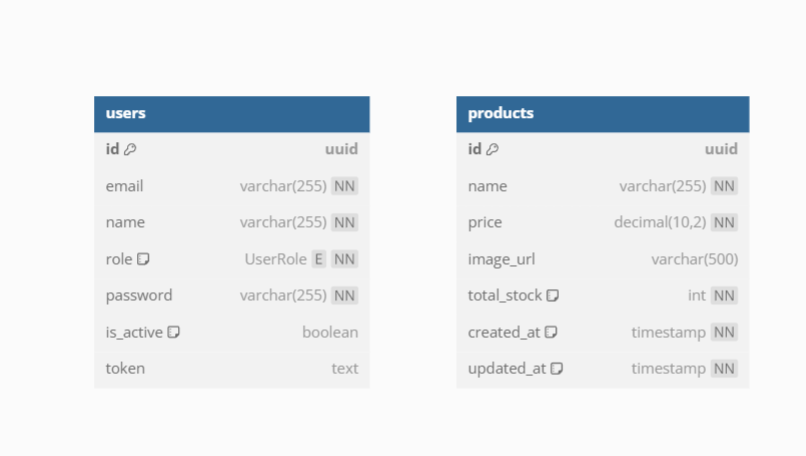
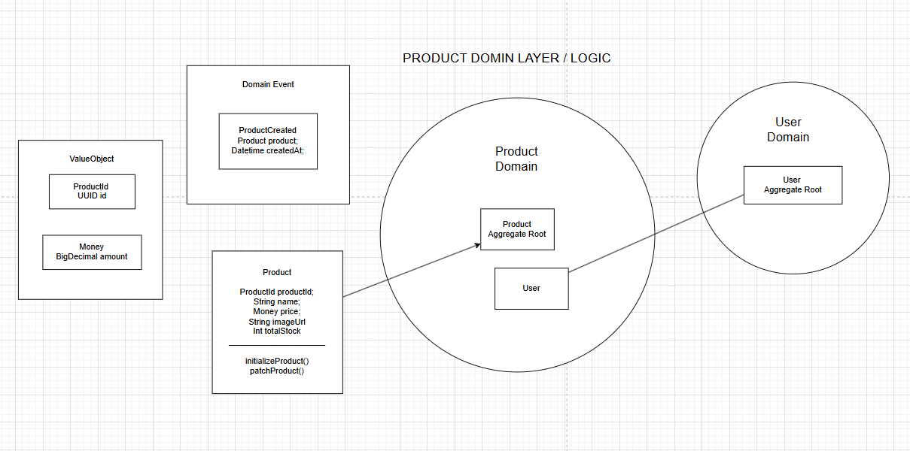
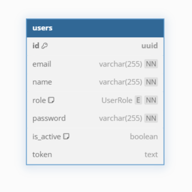
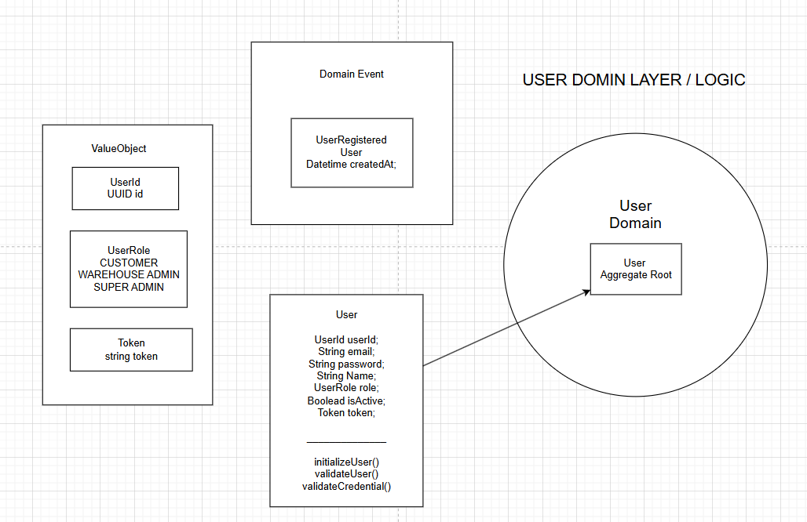
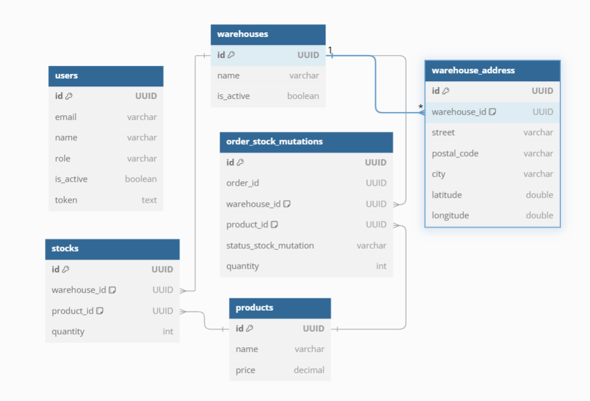
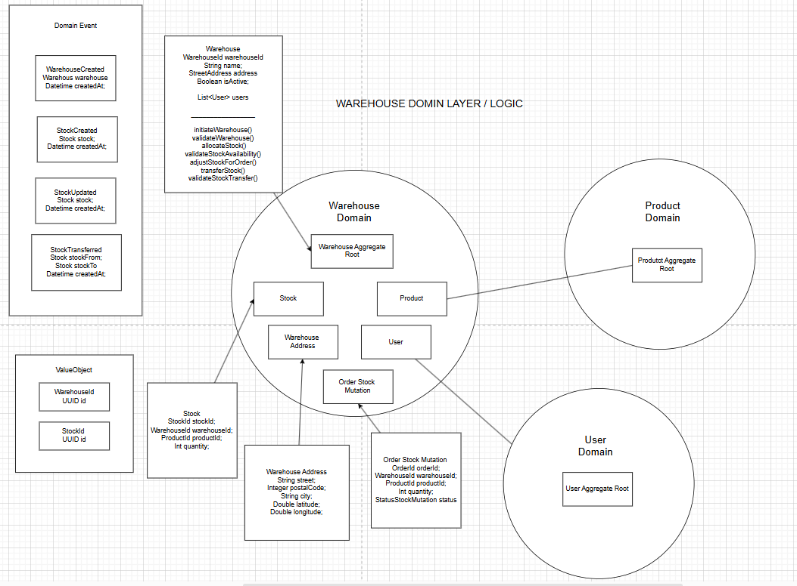
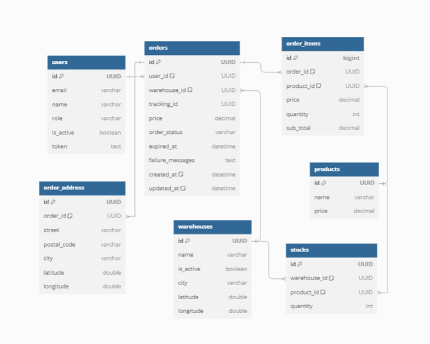
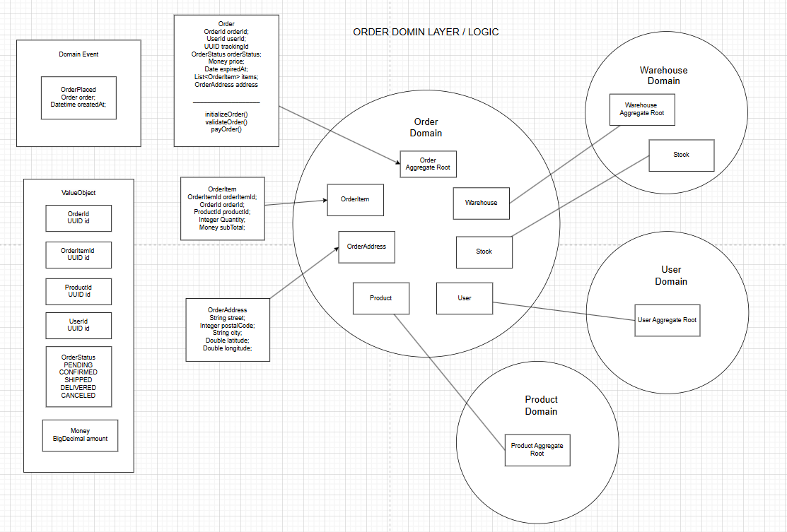

# Multi-Warehouse E-Commerce Microservice

This application demonstrates a Java-based multi-warehouse e-commerce system built with a microservices architecture and event-driven design using Kafka. The system includes product, user, warehouse, and order services, with Kubernetes deployment support.

---

## High-Level System Architecture

- The application leverages an event-driven architecture using Kafka.
- Each service is independent and communicates via Kafka topics for scalability and resilience.
- High-level design includes the following services:
    - **Product Service**: Manages product catalog.
    - **User Service**: Handles user authentication.
    - **Warehouse Service**: Manages warehouses and their inventory.
    - **Order Service**: Handles order processing and status updates.

System architecture images:

1. **High-Level System Design**:
   
2. **Low-Level System Design**:
   

---

## Prerequisites

Ensure the following dependencies are installed:

- Docker and Docker Compose
- Kubernetes CLI (kubectl)
- Helm (for Kafka setup)
- Java JDK (appropriate version for the services)
- Kafka and Zookeeper

---

## Services Overview

### Product Service
- Manages product catalog and inventory.
- Communicates product updates via Kafka.

**Database Design**:


**Domain Design**:

- Manages product catalog and inventory.
- Communicates product updates via Kafka.

**Swagger Documentation**: [Product Service API Docs](http://localhost:8185/product/swagger-ui.html)

### User Service
- Manages user profiles, authentication, and roles.
- Issues JWT tokens for secure communication.

**Database Design**:


**Domain Design**:

- Manages user profiles, authentication, and roles.
- Issues JWT tokens for secure communication.

**Swagger Documentation**: [User Service API Docs](http://localhost:8183/user/swagger-ui.html)


### Warehouse Service
- Manages warehouse details and inventory synchronization.
- Consumes product updates and publishes inventory changes.

**Database Design**:


**Domain Design**:

- Manages warehouse details and inventory synchronization.
- Consumes product updates and publishes inventory changes.

**Swagger Documentation**: [Warehouse Service API Docs](http://localhost:8181/warehouse/swagger-ui.html)


### Order Service
- Processes customer orders.
- Consumes warehouse inventory updates and manages order statuses.

**Database Design**:


**Domain Design**:

- Processes customer orders.
- Consumes warehouse inventory updates and manages order statuses.

**Swagger Documentation**: [Order Service API Docs](http://localhost:8182/order/swagger-ui.html)


---

## Setting Up Locally

### 1. Configure the Database and `application.yml`

Each service requires a database configuration. Ensure the following steps are completed:

1. Create databases and schemas for `order-service`, `warehouse-service`, `product-service`, and `user-service`.
2. Update the `application.yml` configuration file in each service with:
    - Database connection details (host, port, username, password, and schema).
    - Kafka configuration (bootstrap servers and topic names).
    - Any additional service-specific settings.

Example `application.yml` snippet for database configuration:

```yaml
spring:
  datasource:
    url: jdbc:postgresql://127.0.0.1:5432/<db_name>?currentSchema=<db_schema>>&binaryTransfer=true&reWriteBatchedInserts=true&stringtype=unspecified
    username: <db_user>
    password: <db_password>
    driver-class-name: org.postgresql.Driver
  jpa:
    hibernate:
      ddl-auto: update
```

### 2. Start Zookeeper and Kafka Cluster

Navigate to the `infrastructure/docker-compose` directory:

```bash
cd ./infrastructure/docker-compose
```

```bash
docker-compose -f common.yml -f zookeeper.yml -f kafka_cluster.yml up
```

### 3. Initialize Kafka Topics

```bash
docker-compose -f common.yml -f init_kafka.yml up
```

### 4. Start Services Locally
- Ensure each service is configured with appropriate `application.yml` settings for database, Kafka, and other dependencies.
- Start each service using your preferred IDE or build tool.

---

## Deploying on Kubernetes

### 1. Set Up Kafka on Kubernetes

Navigate to the `infrastructure/kubernetes` directory:

```bash
cd ./infrastructure/kubernetes
```

Install Confluent Kafka Helm charts:

```bash
helm install my-confluent helm/cp-helm-charts
```

Deploy Kafka clients:

```bash
kubectl apply -f kafka-client.yml
```

### 2. Create Topics

```bash
kubectl cp create-topics-local.sh kafka-client:/kafka-client-storage
kubectl exec -it kafka-client -- /bin/bash
sh ../../kafka-client-storage/create-topics-local.sh my-confluent-cp-zookeeper-headless
```


### 3. Deploy Services

Apply Kubernetes deployment configurations for each service:

```bash
kubectl apply -f application-deployment-local.yml
```

---

## Example Usage

### Add New Warehouse via API

Use the following `curl` command to create a new warehouse:

```bash
curl --location 'http://localhost:8181/warehouses' \
--header 'Content-Type: application/json' \
--header 'Authorization: Bearer <YOUR_JWT_TOKEN>' \
--data '{
  "name": "New Warehouse",
  "warehouseAddress": {
    "street": "123 Warehouse St",
    "postalCode": "12345",
    "city": "Warehouse City",
    "latitude": 40.7128,
    "longitude": -74.0060
  }
}'
```

This request will:
- Create a new warehouse in the Warehouse Service.
- Send a message to the Kafka topic.
- Trigger the Order Service to consume the message and update its database.

---

## Key Commands

- **Start Kafka and Zookeeper**:
  ```bash
  docker-compose -f common.yml -f zookeeper.yml -f kafka_cluster.yml up
  ```

- **Initialize Kafka Topics**:
  ```bash
  docker-compose -f common.yml -f init_kafka.yml up
  ```

- **Deploy on Kubernetes**:
  ```bash
  helm install my-confluent helm/cp-helm-charts
  kubectl apply -f kafka-client.yml
  kubectl apply -f application-deployment-local.yml
  ```

---

## Postman Collection

A Postman collection is available in the `documentation` directory to test the API endpoints of all services. Import the collection into Postman to interact with the APIs.

Path to the Postman collection:

```bash
./documentation/postman_collection.json
```

---

## Additional Notes

1. Ensure the Kafka topics and service configurations match your application setup.
2. Monitor logs for debugging using:

   ```bash
   kubectl logs -f <POD_NAME>
   ```
3. For scaling, configure Kafka partitions and service replicas based on load.

---
